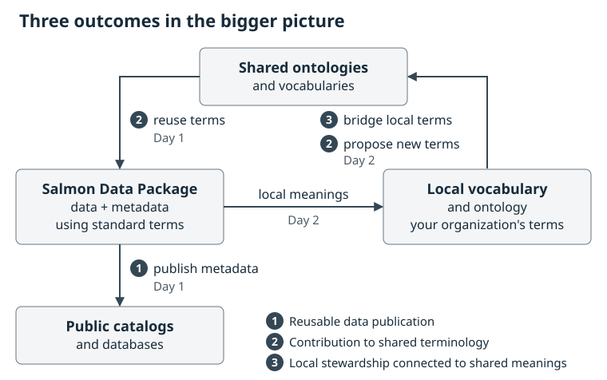

:::::::::::::::::::::::::::::::::::::: questions

- What changes between a source spreadsheet and a reusable published dataset?
- What will we make at each stage of the workshop?
- Why do we describe the data ourselves before using packaging software or AI?

::::::::::::::::::::::::::::::::::::::::::::::::

::::::::::::::::::::::::::::::::::::: objectives

- Recognize the source table and the publication, shared-contribution, and local-stewardship outcomes for the same Fraser Coho example.
- Name each stage's problem and output without needing to run the software.
- Distinguish data values, descriptions of those values, and links to shared definitions.
- Explain why the first working diagram and dictionary must precede metasalmon and AI.

::::::::::::::::::::::::::::::::::::::::::::::::

## Two days, three connected outcomes

This workshop supports the following intended outcomes:

1. **Reusable data publication.** Publish a [metadata](glossary.html#metadata) file that public catalogs and databases can read, so other people can find, understand and reuse your data.
2. **Contribution to shared terminology.** Describe your data with terms from a shared [controlled vocabulary](glossary.html#controlled-vocabulary), and propose a new term when none fits.
3. **Local vocabulary and ontology stewardship connected to shared meanings.** Maintain your organization's own vocabulary or [ontology](glossary.html#ontology), and link local terms to the shared meanings they match or relate to.

| Outcome | Day 1 | Day 2 |
| --- | --- | --- |
| 1. Reusable data publication | Build a package and export its catalog metadata | — |
| 2. Contribution to shared terminology | Reuse published terms | Propose and steward terms |
| 3. Local stewardship connected to shared meanings | — | Build a vocabulary and model; bridge local terms to shared ones |

**Day 1** is for the biologist who wants to reuse standardized terms and publish data in a [FAIR](glossary.html#fair) way: create a [Salmon Data Package](glossary.html#salmon-data-package), reuse published terms and practise publishing it to a test catalog. On **Day 2**, you build and steward a small vocabulary and [OWL](glossary.html#owl) model and [bridge](glossary.html#bridge) local terms to the Salmon Domain Ontology. It suits people setting up data stewardship for an organization.

{alt="The three outcomes in the bigger picture. A Salmon Data Package reuses terms from shared ontologies and vocabularies (outcome 2, Day 1) and publishes its metadata to public catalogs and databases (outcome 1, Day 1). Its local meanings go into an organization's own vocabulary and ontology (Day 2), which bridges local terms to shared meanings (outcome 3, Day 2) and proposes new shared terms (outcome 2, Day 2) that later packages can reuse."}

The same hand-drawn graph and dictionary support all three outcomes. The [Day 2 guide](advanced.html) introduces a [SKOS](glossary.html#skos) controlled vocabulary, a small [OWL](glossary.html#owl) model, a [bridge](glossary.html#bridge), and a [term-request](glossary.html#term-request) or clarification draft. These examples are in the `semantic-lab/` folder inside the extracted workshop ZIP. The [setup instructions](index.html#download-and-open-the-workshop-kit) explain how to download and open it. We will work with those files from Chapter 8 onward.

## Framing the challenge

Imagine you are comparing coho spawner estimates across rivers or years. A colleague sends you a [dataset](glossary.html#dataset) produced by another team. Before combining its values with your own, you need to know which populations and life stages were included, how the estimates were produced, and what missing values mean. Differences in these details can change the biological questions the data can answer.

Useful descriptions make that context available alongside the data. The [worked publication example](reference.html#teaching-record) brings a table, its definitions, methods, and source information together. Use the questions below to assess how well these descriptions support reuse.

### What to look for in the record

Follow four questions rather than every catalog field:

1. **What is this?** Find the title, scope, source and contact information.
2. **Can I use it?** Find the access conditions, licence and important caveats.
3. **Can I understand it?** Locate the table description, column definitions and method information.
4. **Can I trace it?** Follow the source and version information back to the packaged table.

These are practical aims of [FAIR](glossary.html#fair): findable, accessible, interoperable and reusable data. Accessibility may involve stated conditions; FAIR does not mean that every dataset must be openly downloadable.

## Meet our one shared example

Download and extract the [Fraser Coho workshop kit](files/fraser-coho-workshop.zip). Everyone follows the **173-row, 14-column NuSEDS Fraser Coho 2023–2024 slice** in `raw_data/nuseds-fraser-coho-2023-2024.csv`. Open a copy for viewing in a spreadsheet, or follow the projected table. Keep the source file unchanged.

The example is selected from Fisheries and Oceans Canada's Fraser and BC Interior NuSEDS workbook, available through the [Government of Canada's Open Government Portal](https://open.canada.ca/data/en/dataset/c48669a3-045b-400d-b730-48aafe8c5ee6). The kit preserves its source information, derivation and the current [official DFO dictionary](files/fraser-coho-workshop/raw_data/official-nuseds-dictionary.csv). That dictionary was retrieved on 8 September 2026 and may postdate the workbook used for this slice. The teaching dataset covers Coho for 2023–2024; the full publication contains records beyond this selection.

The table contains 87 distinct `POP_ID` values and **164 distinct population–analysis-year pairs across 173 rows**. Some pairs occur more than once. A row is a source record associated with a population, waterbody and analysis year; **population plus year does not uniquely identify a row**. Keep these records separate while investigating what additional context distinguishes them in Chapter 2.

Six columns let us practice the main kinds of description:

| Source column | What we can see | Question that still needs evidence |
| --- | --- | --- |
| `POP_ID` | A population identifier, such as `46200` | What source unit does the identifier denote? |
| `WATERBODY` | A named waterbody, such as `BONAPARTE RIVER` | How does this named place relate to the population record? |
| `ANALYSIS_YR` | `2023` or `2024`: the year the estimate is for | Why can contributing surveys extend into the next calendar year? |
| `SPECIES` | `Coho` throughout this slice | How is the source species label defined? |
| `NATURAL_ADULT_SPAWNERS` | Numerical estimates and 13 blanks | What does “natural” qualify, and what does a blank mean? |
| `ESTIMATE_METHOD` | Labels such as `Area Under the Curve` | How does the stated procedure affect interpretation? |

We will draft descriptions for these six fields and review the supplied descriptions for the other eight.

## Values and descriptions do different jobs

Here are the first three records from the source CSV, showing the six focus columns. The empty estimate in the second row is also empty in the source.

| POP_<wbr>ID | WATERBODY | ANALYSIS_<wbr>YR | SPECIES | NATURAL_<wbr>ADULT_<wbr>SPAWNERS | ESTIMATE_<wbr>METHOD |
| --- | --- | --- | --- | --- | --- |
| 46200 | BONAPARTE RIVER | 2023 | Coho | 758 | Resistivity Counter |
| 44965 | CLAPPERTON CREEK | 2023 | Coho |  | Not Applicable |
| 46190 | COLDWATER RIVER | 2023 | Coho | 7943 | Combined Methods |

The identifiers, years, estimates and method labels are **data values**. Explaining what they mean is [metadata](glossary.html#metadata): information that helps someone interpret and reuse those values. For example, comparing the two numerical estimates requires understanding which fish were included and how each method produced its result.

An identifier is a label used to refer to something. It is not the thing itself. Likewise, a waterbody, a biological population, a species category and a Conservation Unit describe different things. The table has no Conservation Unit field, so comparisons by CU would need a separate source linking populations to those units.

One compound name is enough to motivate the next chapters: `NATURAL_ADULT_SPAWNERS`. A [variable](glossary.html#variable) describes the question being represented, while its [property](glossary.html#property) is the characteristic of interest, such as abundance, and its [entity](glossary.html#entity) is the thing the data concerns. “Adult”, “natural”, the place, the year basis, the unit and the method may add different kinds of meaning. We will separate them and record uncertainty instead of treating the column name as a complete definition.

## Follow one estimate through the workflow

Take the first row's estimate of `758`. Here is a preview of how we can turn that value and its context into descriptions other people can use, while keeping the source's unanswered questions visible.

The same example in words:

1. **Draw what the row describes.** The record refers to the population identified by `46200`, names `BONAPARTE RIVER`, and reports `758`. The estimation activity and its result are distinct; the method describes how the result was produced. [Chapter 2](session-2.html).
2. **Write and decompose the dictionary.** A working definition is “reported adult-spawner estimate, excluding jacks; the scope of ‘natural’ needs confirmation.” Separate the **entity** (source population), **property** (abundance), **result** (`758`), and **unit** (individuals in the starter dictionary, to confirm). Keep year, place and method as context. Peer-review this explanation, then build the package. [Chapters 3–4](session-3.html).
3. **Reuse terms whose definitions fit.** Compare the property with the Salmon Domain Ontology's existing [Abundance definition](https://github.com/salmon-data-mobilization/salmon-domain-ontology/blob/d45f8f7cc857d92af8bbe54a7c89b2a4a14784b2/ontology/modules/02-observation-measurement.ttl), and record a supported link to its IRI. Evaluate AI suggestions against the same human explanation and source evidence. [Chapters 5–6](session-5.html).
4. **Make the data discoverable.** Validate the package, export its metadata and follow the KNB test publication preview. A catalog record lets someone find the data and follow its descriptions and term links. [Chapter 7](session-7.html).
5. **Develop meanings that are missing.** Clarify unclear source definitions, then draft a local vocabulary or ontology, a [bridge](glossary.html#bridge), or a request for a reusable term in the Salmon Domain Ontology. After steward review and term publication, link the released identifiers in a later version of the dataset's metadata. [Chapters 8–12](session-8.html).

There are two connected outputs: **a catalog record for finding and assessing the dataset**, and **maintained terms for describing meanings across datasets**. Publishing the data and publishing a vocabulary or ontology each has its own review and release process.

### A few names you will hear later

A **Salmon Data Package (SDP)** keeps the table, [data dictionary](glossary.html#data-dictionary), code definitions, dataset description and other context together. `metasalmon` in R and `metasalmonpy` in Python help create and inspect that package. We will use them in Chapter 4.

The workshop [Glossary](glossary.html) is a reading aid: it explains words used in these lessons. A [controlled vocabulary](glossary.html#controlled-vocabulary) is a maintained set of terms and definitions used to describe data consistently. Reading a glossary entry helps you understand the discussion; choosing a vocabulary term requires checking its maintained definition against your data.

An [ontology](glossary.html#ontology) also states relationships between concepts. An [IRI](glossary.html#iri) is a stable identifier used to refer to a term. Later, we compare the meaning we have documented with candidate definitions in the Salmon Domain Ontology and other resources. Similar wording does not establish an exact match.

[EML](glossary.html#eml) is a structured format for ecological metadata. Catalogs such as [KNB](glossary.html#knb), part of the DataONE network, use metadata to help people discover and assess data. We will return to the opening record in Chapter 7 and explain how the workshop's artifacts support it.

::::::::::::::::::::::::::::::::::::: challenge

## Activity: Read the example as a future user

In pairs, inspect the source table and teaching record or local preview. Spend 10 minutes identifying one question you could answer from the table and one you could not answer safely.

Then write three short notes:

- The field or value that raises your question.
- The description, relationship or source evidence that would help.
- The workshop stage where you expect to resolve it.

Share one example. Keep unanswered questions for the diagram and dictionary exercises, together with the additional information you would need to answer them.

::::::::::::::::::::::::::::::::::::::::::::::::

::::::::::::::::::::::::::::::::::::: keypoints

- The same 173-row, 14-column Fraser Coho slice carries every chapter.
- The workshop supports three intended outcomes: reusable data publication on Day 1, shared terminology on both days, and local stewardship connected to shared meanings on Day 2.
- A reusable dataset needs understandable values, context, relationships, sources and access conditions.
- The dataset has 164 distinct population–year pairs; that pair does not uniquely identify every row.
- We draw and describe the dataset, then peer review our account, before using metasalmon or AI.
- A catalog record helps people find data; its descriptions help them assess whether those data suit their question.

::::::::::::::::::::::::::::::::::::::::::::::::
