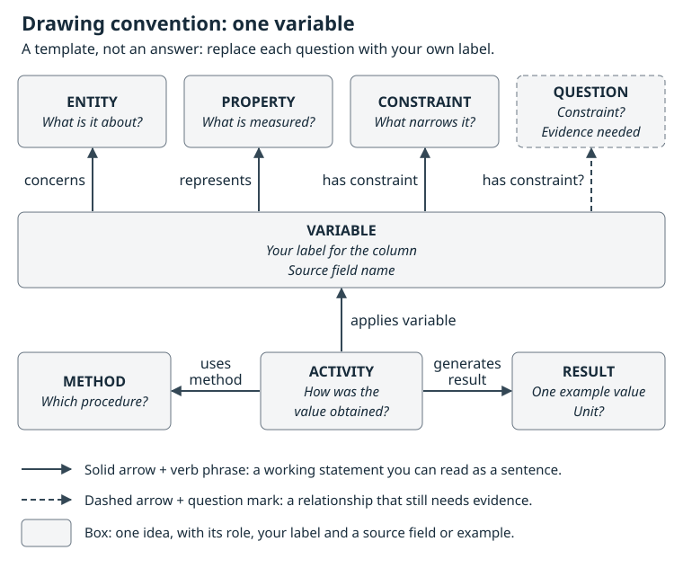
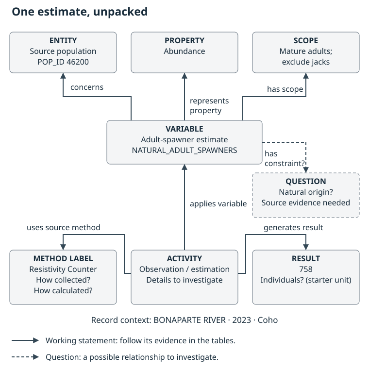

:::::::::::::::::::::::::::::::::::::: questions

- What does one spawner estimate tell us, and what context is still implicit?
- Which fish does it concern, and how were they observed and the estimate calculated?
- How can a drawing distinguish supported relationships from open questions?
- How does one drawn variable help us judge a tool's suggestions?

::::::::::::::::::::::::::::::::::::::::::::::::

::::::::::::::::::::::::::::::::::::: objectives

- Draw one key variable, `NATURAL_ADULT_SPAWNERS`, as its property, entity and constraints, using `POP_ID` and `ESTIMATE_METHOD` as starting context.
- Separate questions about field observations from questions about estimate calculation.
- Use named nodes and verb-labelled arrows to explain a working interpretation or ask a precise question.
- Save the drawing and its node/edge notes for Chapter 3, and reuse it to check suggestions for other variables.

::::::::::::::::::::::::::::::::::::::::::::::::

## Start with three columns

Open `raw_data/nuseds-fraser-coho-2023-2024.csv` from the [extracted workshop kit](index.html#download-and-open-the-workshop-kit). Use paper, a whiteboard or a drawing application, together with a spreadsheet or text editor.

Begin with three columns from the first record:

| POP_ID | NATURAL_ADULT_SPAWNERS | ESTIMATE_METHOD |
| --- | --- | --- |
| 46200 | 758 | Resistivity Counter |

What would a biologist need to know before comparing `758` with another estimate? Start with the fish being described, which fish are included, and the work that produced the number.

Work inside the extracted kit:

```text
fraser-coho-workshop/
  raw_data/       original CSV and source documentation
  worksheets/     your drawing, node/edge notes and dictionary
  reference/      worked examples and source questions
```

Save your work in `worksheets/` and keep the files in `raw_data/` unchanged. If drawing on paper, photograph or scan the finished sketch and save it with your notes.

## Use a small drawing convention

A **node** names one thing or idea. An **edge** is an arrow expressing a relationship between two nodes. These are the basic elements described in [yEd's graph tutorial](https://yed.yworks.com/support/tutorial/create_graph.html); paper and other drawing tools work equally well.

Use these four conventions for our sketches:

| Mark | How to use it | Example |
| --- | --- | --- |
| A labelled box with a local ID | Put one idea in each node. Add its role or source field. | `N2: source population — identified by POP_ID 46200` |
| An arrow with a verb phrase | Read from start to end as a sentence. | `variable → concerns → source population` |
| A clearly labelled example value | Distinguish the reported result from the variable it describes. | `N9: reported result — example 758` |
| A dashed arrow and a question mark | Record a possible relationship that needs evidence. | `variable ⇢ has constraint? ⇢ natural origin?` |

Choose whatever layout, shapes or colours help you think. The labels, arrows and question marks carry the meaning. The dashed-line convention is our workshop shorthand for uncertainty; it is not an OWL assertion.

If a blank page is hard to start, copy this skeleton. It shows the marks and where each part of one variable goes. It is a template, not the answer: replace each question with your own label and evidence.

{alt="Drawing skeleton with no dataset values. A variable box holds your label and the source field name. Solid arrows labelled concerns, represents and has constraint point to entity, property and constraint boxes, which ask what the variable is about, what is measured and what narrows it. A dashed arrow labelled has constraint? points to a dashed question box for a possible constraint that needs evidence. Below, an activity box applies the variable, uses a method and generates a result: one example value and its unit."}

Add a short evidence note beside a relationship or in the [node](files/fraser-coho-workshop/worksheets/dataset-nodes.csv) and [edge](files/fraser-coho-workshop/worksheets/dataset-edges.csv) worksheets. Use “observed in file”, “working interpretation” or “question”. Keep local drawing IDs such as `N2` separate from source identifiers such as `46200`. In yEd, the [description and URL properties](https://yed.yworks.com/support/manual/properties.html) can hold supporting notes and source links.

## Draw one key variable first

Start with one variable, `NATURAL_ADULT_SPAWNERS`. Write **adult-spawner estimate** and the source field name in a central box, and keep the three-cell record beside it as evidence. The central box describes the [variable](glossary.html#variable); `758` is one reported [result](glossary.html#result).

Ask the variable three questions, one branch each:

1. **What is measured?** The characteristic of interest is **abundance**: how much of the population or group is represented. Add it as a [property](glossary.html#property) node with a “represents” arrow.
2. **What is it about?** Add a population node and a “concerns” arrow. `POP_ID = 46200` identifies the source population. Ask what population or group of fish that identifier covers. This is the [entity](glossary.html#entity) question. The entity could be a population or a Conservation Unit, but this table identifies populations and has no CU field; linking a population to a CU would need another source.
3. **What narrows it?** Add [constraint](glossary.html#constraint) nodes with “has constraint” arrows. The current official dictionary describes mature salmon excluding jacks, so *adult* and *jacks excluded* have support in that definition. The field name also says “natural”, but the definition does not establish natural origin. Put natural origin on a dashed arrow with a question mark.

## Then add how the value was obtained

Add an observation/estimation activity and connect it to the source [method](glossary.html#method) label. Ask separately how observations were collected and how they became an estimate. Connect the activity to the reported result `758`. Keep any unit claim beside the result; the starter dictionary supplies “Individual”, whose applicability still needs checking across estimate types.

This introduces the decomposition approach used by [I-ADOPT](https://www.rd-alliance.org/system/files/InteroperAble%20Descriptions%20of%20Observable%20Property%20Terminologies%20%28I-ADOPT%29%20WG%20-%20output%20and%20recommendations_0.pdf): describe a variable through its property, entity and constraints. The Salmon Domain Ontology's [metamodel view](https://github.com/salmon-data-mobilization/salmon-domain-ontology/blob/main/ontology/views/README.md) connects that description to the activity, method and result. Chapter 3 develops the fuller decomposition in a dictionary.

### Field observations and estimate calculation are different questions

`ESTIMATE_METHOD` does not always answer both. Compare these source labels and definitions:

| Source label | What the supplied evidence tells us | What to ask next |
| --- | --- | --- |
| `Resistivity Counter` | The label occurs in the table, but its official dictionary definition is `N/A`. | What was detected in the field? How were detections classified or adjusted to produce `758`? |
| `Area Under the Curve` | The official definition describes integrating abundance over time and dividing by survey life. | How were the observations collected, and which survey-life assumption and calculation were used? |
| `Combined Methods` | The definition describes a final estimate combining two or more estimate methods. | Which field and analytical methods were combined, and how? |

Use the kit's [official dictionary](files/fraser-coho-workshop/raw_data/official-nuseds-dictionary.csv) and [method evidence table](files/fraser-coho-workshop/reference/code-definitions-working.csv). The dictionary was retrieved on 8 September 2026 and may postdate the 2025 source workbook. An unanswered method question is a useful part of the drawing. One source record may summarize several visits or calculations.

## Add enough context to explain the record

Return to the first record's `WATERBODY`, `ANALYSIS_YR` and `SPECIES` values. Attach the named place, estimate year and species to the source-record context. A year or place that varies by row is different from a fixed constraint on the whole variable.

[Row grain](glossary.html#row-grain) describes what a record represents. This source has **173 rows and 164 distinct population–year pairs**, so that pair does not uniquely identify a record. For example, population `46170` has two 2023 records naming `NICOLA RIVER (DAM)` and `NICOLA RIVER (DOT)`. Keep the records separate and ask which additional context distinguishes them.

## Reuse the drawing

Once you have drawn one variable, you have a basis for reviewing automated suggestions for other variables. In Chapter 5, compare each suggested entity, property or constraint with your drawing before accepting it; for any other variable, ask the same three questions first. If you bring your own data to the solo hour after the group walkthrough, draw individual variables from it the same way. Use each drawing to check whether you trust the tool's suggestions for that column.

::::::::::::::::::::::::::::::::::::: challenge

## Activity: draw, explain and revise

1. **Draw one variable for 10 minutes.** Start with the three-cell example. Put the variable in the centre and add its property, entity and constraints. Use a dashed arrow for any constraint the sources do not establish.
2. **Add how the value was obtained for 5 minutes.** Add the activity, the source method label and the result `758`. Include at least one specific unanswered question.
3. **Explain for 10 minutes.** Your partner reads each arrow as a sentence. Then open the answer key below, compare it with your sketch and identify which method or constraint claims need more evidence.
4. **Revise for 10 minutes.** Clarify the arrows, add the row's place/year/species context, and enter your nodes and edges in the worksheets. Save the editable drawing or paper capture with them.

**Ready for Chapter 3:** the three starting fields can be traced through your sketch; every arrow is labelled; example values and concepts are distinguishable; and open questions have a source or next step to investigate. Chapter 3 uses this drawing to describe the six focus fields and review the remaining eight fields before the package build.

:::::::::::::::::::::::: solution

## Answer key: one worked drawing

Open this after your own attempt. It is a simplified view of the metamodel applied to the first record: a draft working interpretation, not a reviewed answer. Follow one arrow at a time; your drawing can use different words or positions.



The drawing reads as these statements:

- The adult-spawner **variable** concerns a source **population**, represents **abundance**, and has a working adult scope excluding jacks: the constraints drawn from the current official definition.
- An observation or estimation **activity** applies that variable, uses a **method**, and generates a **result**. The source labels the method `Resistivity Counter` and reports `758`; the detailed procedure remains a question.
- The possible **natural-origin constraint** is dashed because its applicability to this source field is unresolved.

For a glimpse of later term reuse, compare that question with the Salmon Domain Ontology's [Natural-origin definition](https://github.com/salmon-data-mobilization/salmon-domain-ontology/blob/d45f8f7cc857d92af8bbe54a7c89b2a4a14784b2/ontology/modules/07-controlled-vocabularies.ttl#L144-L151): fish born and reared in the wild. Its identifier is `https://w3id.org/smn/NaturalOrigin`. The starter dictionary uses natural-origin wording, but the official NuSEDS definition does not establish that restriction. A term can be well defined while its application to a dataset remains uncertain. Plain-language questions are enough for your sketch; choosing term identifiers comes in Chapter 5.

The [worked node table](files/fraser-coho-workshop/reference/measurement-sketch-nodes.csv), [edge table](files/fraser-coho-workshop/reference/measurement-sketch-edges.csv), and [editable diagram source](files/fraser-coho-workshop/reference/measurement-sketch-working.mmd) show the labels, evidence and questions behind this example. For the context step, compare your additions with the [expanded working graph](files/fraser-coho-workshop/reference/dataset-graph-working.svg) and its [notes](files/fraser-coho-workshop/reference/dataset-graph-working.html), which cover location, time and source-record relationships.

::::::::::::::::::::::::

::::::::::::::::::::::::::::::::::::::::::::::::

::::::::::::::::::::::::::::::::::::: keypoints

- Start with one key variable and a few source fields, then add the relationships needed to interpret it.
- Entity, property and constraints describe the variable; the activity, method and result describe how a value was produced.
- A field-observation method and an estimate-calculation method answer different questions.
- Dashed arrows and precise questions make missing evidence visible.
- One drawn variable is a basis for checking a tool's suggestions for other variables, including your own data's.
- A saved sketch and node/edge notes give the dictionary exercise a clear starting point.

::::::::::::::::::::::::::::::::::::::::::::::::
